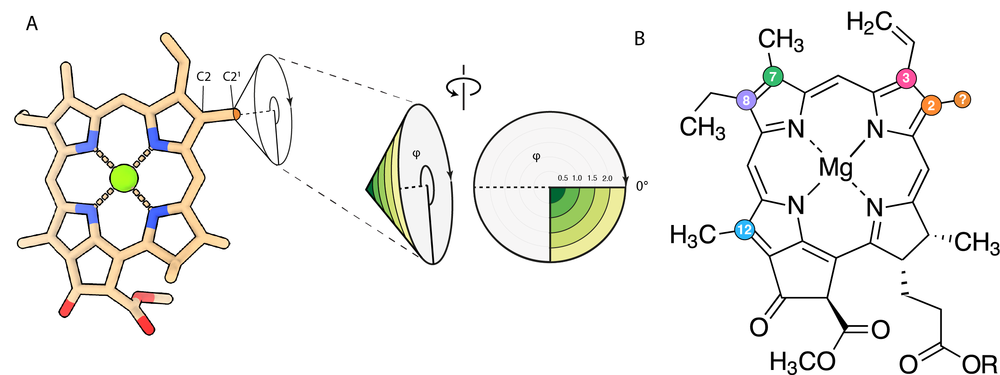

# Chlorophyll ESP polar plot

## Purpose

The assignment of different chlorophyll substituents in CryoEM maps is proven to be a difficult task, and high resolution maps are needed to be able to distunguish the Coulomb potential of single atoms. The problem is exacerbated by the increased negative potential around formyl groups, present at the C7 position in Chl b, at the C2 position in Chl f and at the C3 position (instead of a vinyl) in Chl d.

Inspired by the Cone scan methods from Gisriel et al (https://doi.org/10.1038/s42003-020-01139-1), this script extends the method to pick up a more complete fingerprint of chlorophyll substituents.

The following analysis has been used in https://doi.org/10.1101/2024.08.06.606606.

## chl_analyzer.py

It takes as input a PDB model (.pdb, .cif) and a CryoEM map (.map, .mrc), a reference substituent and an optional local resolution map, and outputs three pickle files:

1) raw ESP cones for each chlorophyll substituent
2) Z-scores of the ESP for each chlorophyll substituent relative to the reference substituent selected
3) average and standard deviation of the reference substituent for a map/model combination, for diagnostic or calculation purposes

Moreover, the script outputs a series of PDB files (2 for each chlorophyll substituent in the map) that can be used to visualize the raw ESP and the Z-scores of the ESP directly in [Chimera](https://www.rbvi.ucsf.edu/chimera/). To do this, open the map and the cone.pdb file of interest, select it and color it by B-factor.

## chl_visualizer.py

It takes the .pickle files generated by chl_analyzer.py as input, and provides functions to assess the performance on the map/model couple and to visualize cones of interest.

