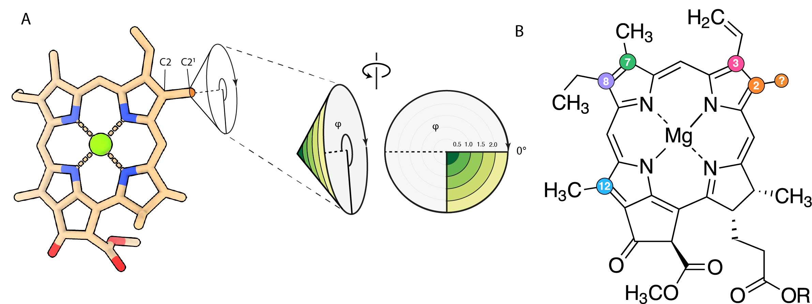

# Chlorophyll ESP polar plot

## Purpose

The assignment of different chlorophyll substituents in CryoEM maps has proven to be a difficult task, and high-resolution maps are needed to be able to distinguish the Coulomb potential of single atoms. The problem is exacerbated by the increased negative potential around formyl groups, present at the C7 position in Chl b, at the C2 position in Chl f and at the C3 position (instead of a vinyl) in Chl d.

Inspired by the cone scan method from Gisriel et al., 2020 ([10.1038/s42003-020-01139-1](https://doi.org/10.1038/s42003-020-01139-1)), this package extends the method to pick up a more complete fingerprint of chlorophyll substituents.

The following analysis has been used in [10.1126/science.ado6830](https://doi.org/10.1126/science.ado6830); a preprint is available at [10.1101/2024.08.06.606606](https://doi.org/10.1101/2024.08.06.606606).

## Usage

The analysis takes as input a PDB model (.pdb, .cif) and a CryoEM map (.map, .mrc), a reference substituent, a scan geometry and an optional local resolution map, and outputs three pickle files:

1) raw ESP scans for each chlorophyll substituent
2) Z-scores of the ESP for each chlorophyll substituent relative to the reference substituent selected
3) average and standard deviation of the reference substituent for a map/model combination, for diagnostic or calculation purposes

### Scan geometry

Two geometries are available via the `--geometry` flag (`geometry=` in the Python API):

| Geometry | Grid | Array shape per substituent | Output files |
| --- | --- | --- | --- |
| `cone` (default) | single 120° aperture × distance × angle | **2-D** `(distance, angle)` | `_cone_data` / `_cone_stats` / `_cone_zscores` |
| `hemisphere` | aperture (90–180°) × distance × angle | **3-D** `(aperture, distance, angle)` | `_hemisphere_data` / `_hemisphere_stats` / `_hemisphere_zscores` |

Every output file is named `<model>_<geometry>_<kind>.pickle`, so the geometry is always visible in the filename.

The algorithm is identical for both: a cone is simply the hemisphere restricted to one aperture. `cone` produces a 2-D NumPy array per DataFrame cell; `hemisphere` sweeps a range of apertures, adding an extra axis, so each cell is 3-D. The statistics, Z-scores and PDB export all work with either. A `hemisphere` run can share an output directory with a `cone` run without overwriting it.

### Scan distances

Both geometries scan the same distance grid by default: 0 to **2.5 Å** inclusive, in steps of **0.1 Å**. Override either end with `--max-distance` / `--step` (`max_distance=` / `step=` in the Python API); the grid always starts at 0 and includes the maximum.

### PDB files

With `--save-pdb` (`save_pdb=True` in the Python API), the analysis also outputs a series of PDB files (2 for each chlorophyll substituent in the map) that can be used to visualize the raw ESP and the Z-scores of the ESP directly in [Chimera](https://www.rbvi.ucsf.edu/chimera/). To do this, open the map and the `.pdb` file of interest, select it and color it by B-factor.

This is off by default: the export is two files per chlorophyll *and* substituent, which quickly fills the output directory, and it is only needed for visual inspection. The three pickle files are written either way, and the `pdb_intensity/` and `pdb_zscores/` subdirectories are only created when the flag is set.

### Installation

```bash
pip install -e .   # or: uv sync
```

### Command line

```bash
chlorophyll-analyzer \
    --structure path/to/model.pdb \
    --map path/to/map.map \
    --outdir output/ \
    --reference C12 \
    --geometry cone \             # cone (default) or hemisphere
    --max-distance 2.5 \          # optional, this is the default
    --save-pdb \                  # optional, off by default
    --locres path/to/locres.map   # optional
```

| Argument | Flag | Required | Description |
| --- | --- | --- | --- |
| structure | `-s`, `--structure` | yes | PDB model (`.pdb`, `.cif`) |
| map | `-m`, `--map` | yes | CryoEM map (`.map`, `.mrc`) |
| outdir | `-o`, `--outdir` | yes | Output directory for the results |
| reference | `-r`, `--reference` | yes | Reference substituent (`C2`, `C3`, `C7`, `C8`, `C12`) |
| geometry | `-g`, `--geometry` | no | Scan geometry: `cone` (default) or `hemisphere` |
| max distance | `-d`, `--max-distance` | no | Maximum scan distance in Å (default `2.5`) |
| step | `-t`, `--step` | no | Spacing between scan distances in Å (default `0.1`) |
| save PDB | `-p`, `--save-pdb` | no | Write the PDB files (off by default) |
| locres | `-l`, `--locres` | no | Local resolution map |

The same interface is available as a module: `python -m chlorophyll_substituents_scan ...`.

### Python API

```python
from chlorophyll_substituents_scan import Analyzer

analyzer = Analyzer(
    structure="path/to/model.pdb",
    density_map="path/to/map.map",
    outdir="output/",
    reference="C12",
    geometry="cone",  # or "hemisphere" for a 3-D aperture sweep
    save_pdb=False,   # write the PDB files; off by default
    locres=None,      # optional local resolution map
)
results_df, stats_df, zscores_df = analyzer.run()
```

## chl_visualizer notebook

It takes the .pickle files generated by the analysis as input, and provides functions to assess the performance on the map/model pair and to visualize cones of interest.


